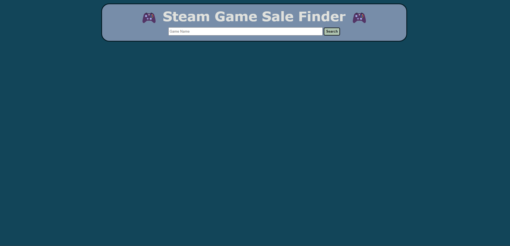

# SGS Search App

Steam Game Sale (SGS) Search App is an application that can be used to find the best price for any given Steam game, given that there are active deals happening.

## Usage

- To use the SGS Search App, open the [application](https://zachatorcodes.github.io/phase-1-project/) in a new tab. Then, enter a game name into the search bar visible on the page. To submit the game search, either click the "Search" button, or go ahead and hit the [ENTER] key.

- Once you have submitted your search, results should be able to be seen on the left side of the page. If no results are visible, make sure that the game's name is spelled correctly. Otherwise, the game might not be included in the fetch's API.

- Each game card should have a button attached to it, opening up more information about the selected game, including the cheapest ever price it has been sold for. If there are any active deals, they will show up below this extra game information. If no deals are visible, there are currently no sales going on for the selected game.

## Contributing

Pull requests are welcome. For major changes, please open an issue first
to discuss what you would like to change.

Please make sure to update tests as appropriate.

## License

[MIT](https://choosealicense.com/licenses/mit/)